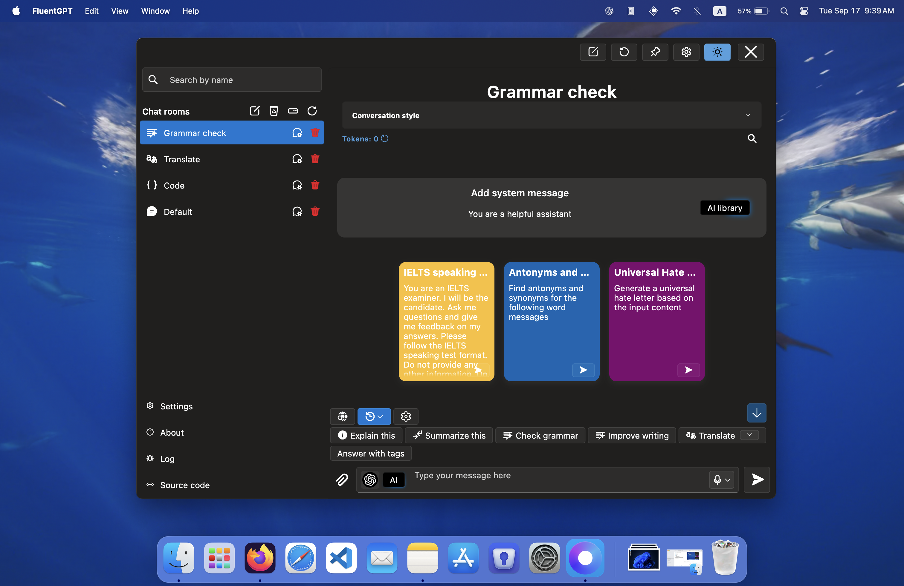

# Fluent GPT App

Welcome to Fluent GPT App, an open-source, multi-platform desktop application that brings the power of GPT models to your fingertips. Designed with a sleek Fluent interface, it offers a unique and customizable chat experience on Windows, macOS, and Linux.

## Features

- **Cross-Platform Support**: Works seamlessly on Windows, macOS, and Linux.
- **Tray Functionality**: Ability to minimize to the system tray for quick access.
- **Custom Shortcut Activation**: Open the app with a custom keyboard shortcut.
- **Multiple Chat Rooms**: Engage with different GPT models in separate chat rooms.
- **Custom Instructions**: Tailor each chat room with specific instructions or guidelines.
- **Integration with ChatGPT from OpenAI**: Use ChatGPT by obtaining a token from OpenAI.
- **Custom GPT**: You can use your own GPT models by providing a URL to the model. 
- **Pin app**: Pin the app to the top of your screen for easy access.
- **Shell support**: GPT can run shell commands on your computer.
- **Quick Prompts**: Users can create their custom quick prompts to use them faster in the chat and overlay.
- **Overlay Mode on Text Selection (macOS only)**: When users select text, the app will show a compact horizontal overlay with pre-created user's quick prompts.
- **Sidebar Mode**: The app will switch to a compact vertical overlay that will show custom user prompts.
- **Run Python Code**: The Fluent GPT App enables seamless integration and execution of Python code locally.
- **Web Search**: Utilize the Brave API to perform web searches.

## Screenshots
Macos
<table>
  <tr>
    <td></td>
    <td></td>
  </tr>
  <tr>
    <td></td>
    <td></td>
  </tr>
</table>

Windows
<table>
  <tr>
  <td></td>
    <td></td>
  </tr>
  <tr>
    <td></td>
    <td></td>
  </tr>
</table>

## Getting Started

### Installation

1. Download the Fluent GPT App from [GitHub Releases](https://github.com/realkalash/fluent_gpt_app/releases).
2. Follow the installation instructions specific to your OS.
3. To use Python download and install python from [here](https://www.python.org/downloads/).
   
---

### Using ChatGPT from OpenAI

To use ChatGPT from OpenAI, you need to obtain a token:

1. Visit [OpenAI API](https://beta.openai.com/signup/) and sign up or log in.
2. Navigate to the API section and follow the instructions to get your API token.

### Using Your Own GPT Models

Fluent GPT App allows the integration of custom GPT models. To use your own model:

1. Ensure your GPT model is accessible via a URL.
2. Open FluentGPT
3. Go to the settings page
4. Paste the URL of your model in the "API and URLs"-> "Local AI" field.

### Configuration

- **Hiding to Tray**: Enable this in settings to allow the app to minimize to the system tray.
- **Setting Custom Shortcut**: Define your custom shortcut in the settings menu.
- **Adding/Managing Chat Rooms**: Create and manage chat rooms through the main interface. Assign different GPT models and set custom instructions for each room.

## Contributing

We welcome contributions!

## License

This project is licensed under the Creative Commons Attribution-NonCommercial-NoDerivs 4.0 International License - see the [LICENSE.md](LICENSE.md) file for details.

Copyright (c) 2024 Alex Kalashnikov.

## Acknowledgments

- OpenAI for providing the GPT models.
- Contributors and supporters of the Fluent GPT App.

---
Some content for this README was generated with ChatGPT-4o, Claude and LLama 3
